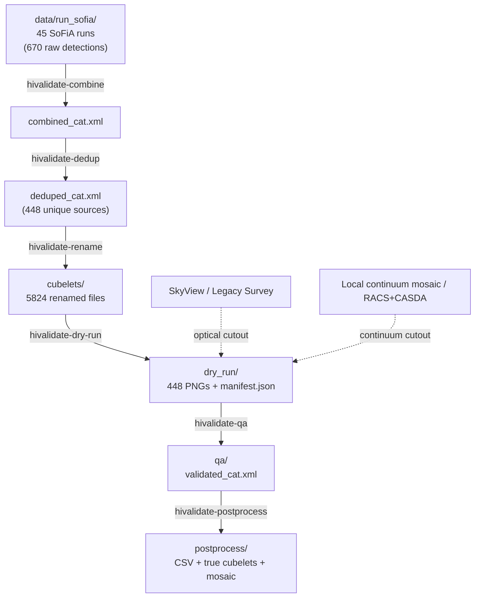

# Pipeline overview

A stage-by-stage walkthrough of `hivalidate`, grounded in a real run: all the numbers
below are from the actual `SB82605` field in `data/run_sofia/` (45 independent SoFiA
runs), not illustrative examples. See [`PLAN.md`](../PLAN.md) for the design history
and the bugs found/fixed at each phase; this document is the "how it works now"
counterpart, not the build log.

## Data flow

Every stage reads and writes through `Config.paths` (see `configs/SB82605.yaml`) --
no stage hardcodes a field/SB name or a directory layout. This is the fix for the
legacy scripts' central problem (PLAN.md issue #9): each one had its own hardcoded
constants that had to be kept in sync by hand across nine separate files.

## Stage 1: Combine (`hivalidate-combine`)

Reads every `*_cat.xml` under `paths.raw_sofia_dir` (SoFiA's own per-run VOTable
catalogues) and vertically stacks them into one table, sorted by RA. Adds a
`source_run` column recording which run each row came from -- this is what later lets
`rename` and `dedup` work correctly despite SoFiA's numeric `id` column resetting to
`1..N` in every run (PLAN.md issue #6): `(source_run, id)` together are a stable key,
`id` alone is not.

Real run: 45 files -> 670 rows.

## Stage 2: Dedup (`hivalidate-dedup`)

Cross-matches the combined catalogue against itself by sky position and velocity
(`catalogue.deduplicate_positional`), not by exact name-string equality like the
legacy script. Two rows within `dedup.sep_arcsec` (default 30") *and* within a
linewidth-scaled velocity tolerance are treated as the same physical source; the
higher-`snr` row of each group is kept.

This matters more than it might sound: adjacent SoFiA runs frequently redetect the
same real source with a slightly different fitted centroid, which produces a
different SoFiA-generated name string and so was invisible to exact-string matching.
Real run: 670 -> 448 (**222 removed, 33%**) -- verified this isn't over-merging by
checking that accepted duplicate pairs have a median separation of 0.33"/0.4 km/s
(clearly the same source refit), while sky-close-but-genuinely-different sources are
correctly rejected by the velocity check (median ~3300 km/s apart in the cases
checked).

## Stage 3: Rename (`hivalidate-rename`)

For each run, maps that run's own numeric `id` to the deduped catalogue's source
`name` (using that run's own catalogue -- never a combined one, per the `id` caveat
above) and copies the matching cubelet files into one shared directory, renamed from
`<run>_<id>_<suffix>` to `<name>_<suffix>`. Only copies cubelets for sources that
survived dedup, so a duplicate detection's files don't linger in the final directory.

Real run: 5824 files copied (448 sources x 13 file types each).

## Stage 4: Dry-run (`hivalidate-dry-run`) -- the HPC-safe stage

For every source: fetches an optical cutout (SkyView, falling back to Legacy Survey)
and a continuum cutout (a local field mosaic if configured, falling back to RACS via
`astroquery.casda`), builds the six-panel validation figure
(`plotting.build_validation_figure`), and saves it as a PNG. Writes a `manifest.json`
recording each source's status, cutout provenance, and (at the top level) the git
commit/version/config that produced the batch.

Three things make this safe to run unattended on an HPC compute node with no display:

- **Forces the `Agg` backend** before anything else is imported, and never calls
  `plt.show()` or blocks on input.
- **Per-source fault isolation** (PLAN.md issue #8): one source's cutout failure or
  plotting exception is logged and the batch continues, rather than aborting.
- **A preflight connectivity check** runs first (also available standalone as
  `hivalidate-check-connectivity`): every configured backend's availability is
  checked once, up front. A chain with *some* backends down but at least one
  working just logs a warning and proceeds (that's what the fallback chain is for);
  a chain that's *entirely* unusable aborts immediately, so a broken CASDA login
  doesn't quietly degrade a few hundred sources' continuum panels before anyone
  notices.

All four sky panels (optical, continuum, mom0, mom1) are pinned to the exact same
real field of view -- computed from the mom0 cubelet's own WCS pixel scale
(`plotting.reference_field_of_view_arcsec`), not assumed or independently
per-backend. This was the source of two real bugs found by inspecting actual
output during Phase 6 (see PLAN.md): a wrong assumed SkyView plate scale, and
nothing constraining the continuum panel's displayed extent to match the others.

Real run: 448/448 sources OK, 0 failures.

## Stage 5: QA (`hivalidate-qa`) -- runs locally, not on HPC

Reads only `manifest.json` and the PNGs dry-run already produced -- never re-fetches
a cutout or regenerates a figure, which is what lets it run somewhere with an actual
display (a laptop) independent of where dry-run ran. For each source: shows the PNG,
prompts for a quality flag (`t`/`f`/`u`/`d` = true/false/uncertain/duplicate, matching
the legacy script's numeric convention for continuity) and an optional comment.

- **Resumable**: every flag is written to `qa_results.json` immediately, not batched
  to the end. Re-running the command skips anything already reviewed.
- **`b` (back)**: re-opens the previous source, discarding its saved flag, so a
  mis-keyed answer doesn't require restarting the session.
- Writes `validated_cat.xml` (the deduped catalogue plus `qa`, `qa_comment`, and the
  optical/continuum provenance pulled from the manifest) after every session, even a
  partial one -- unreviewed sources get `NaN`/empty rather than blocking the file
  from being written at all.

## Stage 6: Post-process (`hivalidate-postprocess`)

Filters `validated_cat.xml` to `qa == 1.0` (true) sources and writes:

- `validated_true.csv` -- just those rows, in plain CSV.
- `true_cubelets/` -- their cubelet files only.
- `mosaic_true.fits` -- their moment-0 maps reprojected onto `paths.field_mosaic`
  (SoFiA's own full-field mosaic), via `reproject.mosaicking.reproject_and_coadd`, so
  true detections can be inspected in context. Skipped (not an error) if
  `field_mosaic` isn't configured for a field.

## Design decisions worth knowing about

- **No stage assumes the previous one just ran in the same process.** Each reads its
  input from disk and validates it exists, with a clear `SystemExit` naming the
  command to run first if not. This is what makes dry-run/QA usable on different
  machines (PLAN.md section 5) and lets any stage be re-run independently.
- **Cutout fallback chains are configured, not hardcoded**: `cutouts.optical_priority`
  and `cutouts.continuum_priority` in the field config list backend names in priority
  order; `cutouts/registry.py` builds the actual backend objects from them. Every
  successful cutout records which backend supplied it (`CutoutResult.provenance`),
  carried through to the dry-run manifest and the final validated catalogue.
- **On-disk cutout cache** (`cutouts.cache_dir`), keyed by `(source, backend, size)`,
  so dry-run and any later re-runs never re-fetch a cutout that's already been
  fetched.
- **Reproducibility metadata**: both the dry-run manifest and the QA output catalogue
  record the git commit, `hivalidate` version, and config field name that produced
  them (`hivalidate.provenance`). The commit hash is captured once at the *start* of
  a batch run, not the end -- a code change committed while a long batch is still
  running must not get attributed to output it didn't actually produce.
