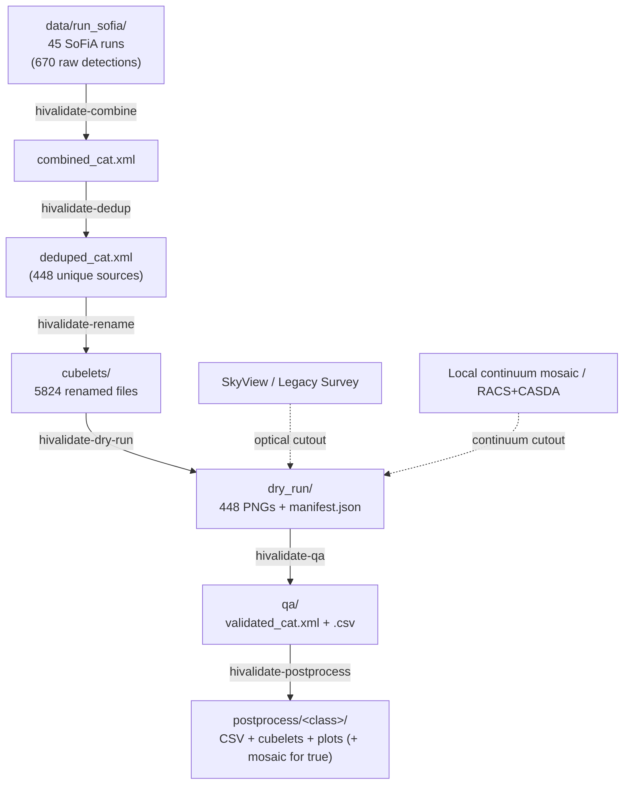

# Pipeline overview

A stage-by-stage walkthrough of `hivalidate`, grounded in a real run: all the numbers
below are from the actual `SB82605` field in `data/run_sofia/` (45 independent SoFiA
runs), not illustrative examples. See [`PLAN.md`](../PLAN.md) for the design history
and the bugs found/fixed at each phase; this document is the "how it works now"
counterpart, not the build log.

## Data flow

Every stage reads and writes through `Config.paths` (see `configs/SB82605.yaml`) --
no stage hardcodes a field/SB name or a directory layout. This is the fix for the
legacy scripts' central problem (PLAN.md issue #9): each one had its own hardcoded
constants that had to be kept in sync by hand across nine separate files.

`hivalidate-run-pipeline --mode dry-run` and `--mode qa` chain stages 0-4 and 5-6
respectively, so the two commands you actually run (one on HPC, one locally) map
directly onto this diagram's HPC/local split instead of six separate invocations.

## Stage 1: Combine (`hivalidate-combine`)

Reads every `*_cat.xml` under `paths.raw_sofia_dir` (SoFiA's own per-run VOTable
catalogues) and vertically stacks them into one table, sorted by RA. Adds a
`source_run` column recording which run each row came from -- this is what later lets
`rename` and `dedup` work correctly despite SoFiA's numeric `id` column resetting to
`1..N` in every run (PLAN.md issue #6): `(source_run, id)` together are a stable key,
`id` alone is not.

Also writes `frequency_flux_diagnostic.png` (`hivalidate.diagnostics.build_frequency_
flux_figure`) -- log10(integrated flux) against frequency and channel for every
combined detection, from `legacy/plot_detections.py`'s QA plot. Channel is computed
from frequency using a reference frequency and channel width read directly from a
cube FITS header (`hivalidate.diagnostics.find_spectral_reference`, `CRVAL3`/
`CDELT3` of the first `*_cubelets/*_cube.fits` file found under `raw_sofia_dir`) --
confirmed identical across every run's cubelets, since they're all cut from the same
parent cube. Falls back to a frequency-only plot (not an error) if no cube file with
a recognisable frequency axis is found.

This isn't the first thing that was tried: an earlier version used the catalogue's
own `z` column directly as "channel", which looked plausible (roughly monotonic with
frequency) but was wrong once checked against the real SB82605 data -- found live by
inspecting the actual plot, same pattern as several other bugs in this project. `z` is
a pixel coordinate local to each run's own input sub-cube; in this field the 45 runs
turned out to cover 5 different sections of the frequency axis (confirmed by fitting
freq-vs-`z` per run: identical channel width everywhere, but a different offset per
group of ~9 runs), so the same `z` value meant a different real frequency depending
which run a source came from, and the resulting channel axis span (roughly 0-1400)
didn't match the field's real ~7800-channel band. `CRVAL3`/`CDELT3`, unlike `z`, are
confirmed identical regardless of run, so a channel computed from frequency using
them is correct no matter where in the combined catalogue a source came from.

A cluster of points bunched at one frequency or channel, rather than spread roughly
evenly across the band, usually means RFI or a bad channel range rather than real
sources -- worth checking before spending time on dedup/rename/dry-run against a
batch that might need re-running with different SoFiA flagging.

Real run: 45 files -> 670 rows.

## Stage 2: Dedup (`hivalidate-dedup`)

Cross-matches the combined catalogue against itself by sky position and velocity
(`catalogue.deduplicate_positional`), not by exact name-string equality like the
legacy script. Two rows within `dedup.sep_arcsec` (default 30") *and* within a
linewidth-scaled velocity tolerance are treated as the same physical source; the
higher-`snr` row of each group is kept.

This matters more than it might sound: adjacent SoFiA runs frequently redetect the
same real source with a slightly different fitted centroid, which produces a
different SoFiA-generated name string and so was invisible to exact-string matching.
Real run: 670 -> 448 (**222 removed, 33%**) -- verified this isn't over-merging by
checking that accepted duplicate pairs have a median separation of 0.33"/0.4 km/s
(clearly the same source refit), while sky-close-but-genuinely-different sources are
correctly rejected by the velocity check (median ~3300 km/s apart in the cases
checked).

## Stage 3: Rename (`hivalidate-rename`)

For each run, maps that run's own numeric `id` to the deduped catalogue's source
`name` (using that run's own catalogue -- never a combined one, per the `id` caveat
above) and copies the matching cubelet files into one shared directory, renamed from
`<run>_<id>_<suffix>` to `<name>_<suffix>`. Only copies cubelets for sources that
survived dedup, so a duplicate detection's files don't linger in the final directory.

Real run: 5824 files copied (448 sources x 13 file types each).

## Stage 4: Dry-run (`hivalidate-dry-run`) -- the HPC-safe stage

For every source: fetches an optical cutout (SkyView, falling back to Legacy Survey)
and a continuum cutout (a local field mosaic if configured, falling back to RACS via
`astroquery.casda`), builds the six-panel validation figure
(`plotting.build_validation_figure`), and saves it as a PNG. Writes a `manifest.json`
recording each source's status, cutout provenance, and (at the top level) the git
commit/version/config that produced the batch.

Three things make this safe to run unattended on an HPC compute node with no display:

- **Forces the `Agg` backend** before anything else is imported, and never calls
  `plt.show()` or blocks on input.
- **Per-source fault isolation** (PLAN.md issue #8): one source's cutout failure or
  plotting exception is logged and the batch continues, rather than aborting.
- **A preflight connectivity check** runs first (also available standalone as
  `hivalidate-check-connectivity`): every configured backend's availability is
  checked once, up front. A chain with *some* backends down but at least one
  working just logs a warning and proceeds (that's what the fallback chain is for);
  a chain that's *entirely* unusable aborts immediately, so a broken CASDA login
  doesn't quietly degrade a few hundred sources' continuum panels before anyone
  notices.
- **Resumable**: `manifest.json` is rewritten after every source, not just once at
  the end, and a re-run skips any source already recorded as `"ok"` with a PNG still
  on disk (a `"failed"` one is always retried). An HPC job killed or Ctrl-C'd partway
  through a batch of hundreds of sources therefore picks back up close to where it
  left off on the next run, instead of reprocessing -- and, if `cutouts.cache_dir` is
  configured, re-fetching -- everything from scratch.

All four sky panels (optical, continuum, mom0, mom1) are pinned to the exact same
real field of view -- computed from the mom0 cubelet's own WCS pixel scale
(`plotting.reference_field_of_view_arcsec`), not assumed or independently
per-backend. This was the source of two real bugs found by inspecting actual
output during Phase 6 (see PLAN.md): a wrong assumed SkyView plate scale, and
nothing constraining the continuum panel's displayed extent to match the others.

Real run: 448/448 sources OK, 0 failures.

## Stage 5: QA (`hivalidate-qa`) -- runs locally, not on HPC

Reads only `manifest.json` and the PNGs dry-run already produced -- never re-fetches
a cutout or regenerates a figure, which is what lets it run somewhere with an actual
display (a laptop) independent of where dry-run ran. For each source: shows the PNG,
prompts for a quality flag (`t`/`f`/`u`/`d` = true/false/uncertain/duplicate, matching
the legacy script's numeric convention for continuity), plus two session-control
letters, `b` (back) and `q` (save & quit), and an optional comment.

The letter typed at the prompt is stored numerically in the `qa` column of
`validated_cat.xml`/`.csv` (`qa.FLAG_TO_NUMERIC`), unreviewed sources getting `NaN`.
`b` and `q` never appear in `qa` themselves -- they control the session, they aren't
a verdict about the source on screen:

| Flag | Meaning         | `qa` value                            |
|------|-----------------|----------------------------------------|
| `t`  | true            | `1.0`                                  |
| `f`  | false           | `0.0`                                  |
| `u`  | uncertain       | `2.0`                                  |
| `d`  | duplicate       | `3.0`                                  |
| `b`  | back            | n/a -- re-opens the previous source    |
| `q`  | save & quit     | n/a -- ends the session early          |

- **Resumable**: every flag is written to `qa_results.json` immediately, not batched
  to the end. Re-running the command skips anything already reviewed.
- **`b` (back)**: typed at the flag prompt (in place of `t`/`f`/`u`/`d`/`q`), instead
  of answering for the *current* source it discards the *previous* source's saved
  flag/comment and re-displays that source so you can answer again -- for a
  mis-keyed answer that doesn't require restarting the session. Each `b` steps back
  exactly one source and can be chained (`b` three times in a row steps back three
  sources); it's a no-op, not a crash, if there's no previous source to go back to
  (the very first source of the session).
- **`q` (save & quit)**: stops the review loop before reaching the end of the
  catalogue -- not needed to avoid losing work (every flag is already saved
  immediately, per "Resumable" above), just to end the session on your own terms.
  Re-running `hivalidate-qa` (or `--mode qa`) afterward resumes right where you quit.
- Writes `validated_cat.xml` and `validated_cat.csv` (identical content, VOTable and
  plain CSV) -- the deduped catalogue plus `qa`, `qa_comment`, and the
  optical/continuum provenance pulled from the manifest -- once the session ends,
  including a partial one ended by `q` -- unreviewed sources get `NaN`/empty rather
  than blocking the file from being written at all. Note this is a different case
  from Ctrl-C: an interrupt is caught and logged, but skips this write entirely (see
  `qa_results.json` under "Resumable" for what *is* saved from an interrupted
  session) -- re-run the same command to reach a clean `q` (or the natural end of the
  catalogue) and get `validated_cat.xml`/`.csv` written.
- **`optical_provenance`/`continuum_provenance`** record which cutout backend (and,
  for some backends, which specific survey/file) actually supplied that source's
  image -- e.g. `skyview:DSS2 Red`, `legacy_survey:ls-dr9`, `local:field_mosaic.fits`,
  `racs_casda:RACS-DR1_....fits` -- or empty if every backend in that source's
  fallback chain failed (dry-run degrades to a blank panel rather than failing the
  whole source). `cutouts.optical_priority`/`continuum_priority` in the field config
  is a *fallback chain*, so two sources in the same batch can silently come from
  different backends if the first choice failed only for one of their positions (an
  outage, a coverage gap, a cache miss) -- a panel that looks different from its
  neighbours may just be a different survey with different depth/resolution, not
  something astrophysical. Carrying provenance straight through from
  `manifest.json` into the final catalogue means a surprising flag can be explained
  later ("only had a shallower Legacy Survey image, not SkyView") without digging
  through logs.

## Stage 6: Post-process (`hivalidate-postprocess`)

Filters `validated_cat.xml` by `qa` value into every reviewed class -- true (`1.0`),
false (`0.0`), uncertain (`2.0`), duplicate (`3.0`) -- and, for each one, writes its
own `postprocess/<class>/` subdirectory:

- `validated_<class>.csv` -- just that class's rows, in plain CSV.
- `cubelets/` -- that class's cubelet files only, pulled from `cubelets/`.
- `plots/` -- that class's dry-run validation PNGs, pulled out of the shared flat
  `dry_run/` directory. This is what makes it practical to flick back through, say,
  every "uncertain" source later without hunting through hundreds of unrelated PNGs
  for sources that were already resolved one way or the other.

A class with zero matching sources still gets its own (empty) CSV/cubelets/plots
directories, so a partially-reviewed catalogue is a normal input, not an error.

`postprocess/true/mosaic_true.fits` is the one class-specific extra: the true class's
moment-0 maps reprojected onto `paths.field_mosaic` (SoFiA's own full-field mosaic),
via `reproject.mosaicking.reproject_and_coadd`, so true detections can be inspected in
context. Built only for the true class ("where are the real detections" doesn't apply
to the other three) and skipped entirely (not an error) if `field_mosaic` isn't
configured for a field.

## Design decisions worth knowing about

- **No stage assumes the previous one just ran in the same process.** Each reads its
  input from disk and validates it exists, with a clear `SystemExit` naming the
  command to run first if not. This is what makes dry-run/QA usable on different
  machines (PLAN.md section 5) and lets any stage be re-run independently.
- **Cutout fallback chains are configured, not hardcoded**: `cutouts.optical_priority`
  and `cutouts.continuum_priority` in the field config list backend names in priority
  order; `cutouts/registry.py` builds the actual backend objects from them. Every
  successful cutout records which backend supplied it (`CutoutResult.provenance`),
  carried through to the dry-run manifest and the final validated catalogue.
- **On-disk cutout cache** (`cutouts.cache_dir`), keyed by `(source, backend, size)`,
  so dry-run and any later re-runs never re-fetch a cutout that's already been
  fetched.
- **Reproducibility metadata**: both the dry-run manifest and the QA output catalogue
  record the git commit, `hivalidate` version, and config field name that produced
  them (`hivalidate.provenance`). The commit hash is captured once at the *start* of
  a batch run, not the end -- a code change committed while a long batch is still
  running must not get attributed to output it didn't actually produce.
